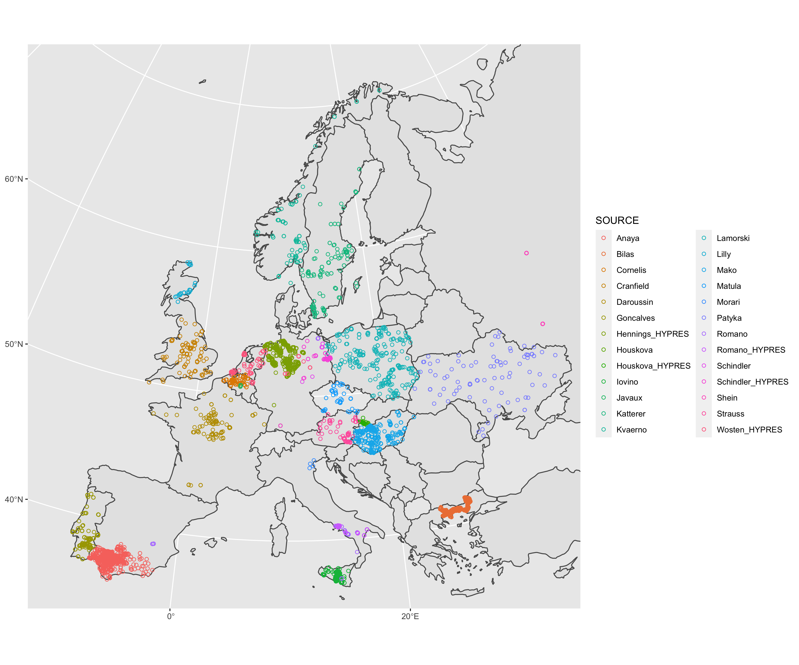

# eu_hydi_build

Import, clean and harmonize data for the European Hydrolopedological Inventory (EU-HYDI).

The EU-HYDI is a dataset of **soil hydrological, physical and chemical properties** assembled in 2013 in the context of EU FP7 project MyWater. It contains data from more than 18000 soil samples contributed by 27 institutions across Europe. The compilation work was led by Mélanie Weynants at the Joint Research Centre of the European Commission (JRC).

This repository contains all R scripts used to import, clean and harmonize the data provided by contributors. The intellectual property and rights to the raw data remain with the individual contributors. Copies of the compiled dataset are hosted at the JRC and with the individual contributors. A subset of the EU-HYDI is licensed for public use under the terms of the [European Soil Data Centre (ESDAC)](https://esdac.jrc.ec.europa.eu) of the JRC, from where it can be accessed.

## Workflow

The workflow is executed from [rcode/ReadMe.r](./rcode/ReadMe.r). Raw data should be stored in ./data.

## Summary

A summary of the dataset completeness can be found in [euhydi_stats.md](./euhydi_stats.md)

## Reference
Weynants, M., Montanarella, L., Tóth, G., Arnoldussen, A., Anaya Romero, M., Bilas, G., Borresen T., Cornelis W., Daroussin J., Gonalves M., Hannam J., Haugen L.E., Hennings V., Houskova B., Iovino M., Javaux M., Keay C.A., Kätterer T., Kvaerno S., Laktinova T., Lamorski K., Lilly A., Mako A., Matula S., Morari F., Nemes A., Patyka N.V., Romano N., Schindler U., Shein E., Slawinski C., Strauss P, Tóth B., Wösten, H. (2013). European HYdropedological data inventory (EU-HYDI). EUR – Scientific and Technical Research series – vol. EUR 26053 EN. Publications Office of the European Union, Luxembourg, GD Luxembourg. https://doi.org/10.2788/5936
    

